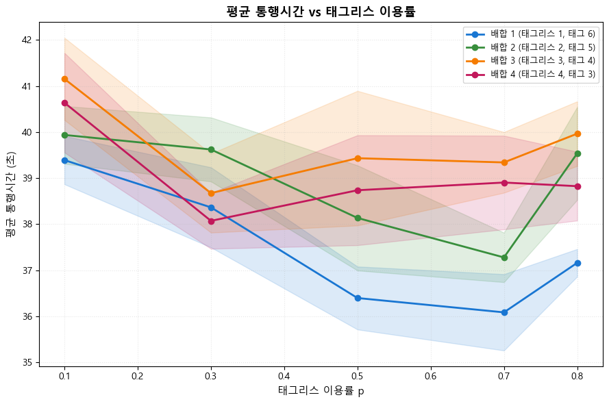
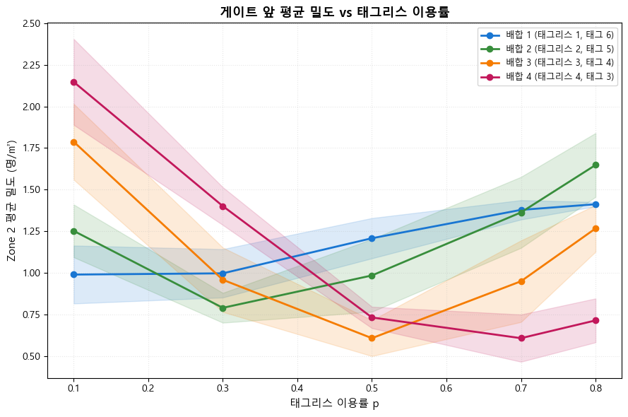
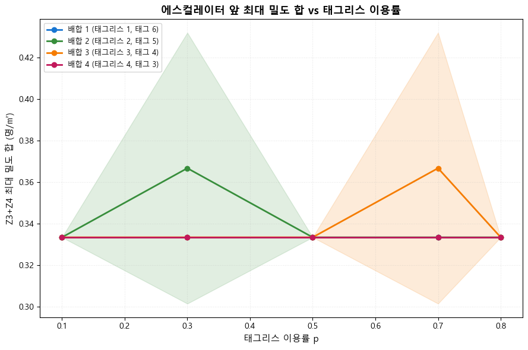
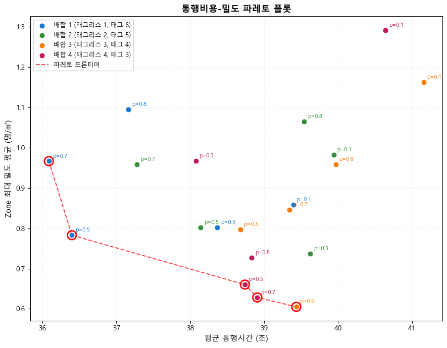

# 태그리스 게이트 배합 민감도 분석 보고서

**생성일**: 2026-04-18

## 1. 시나리오 매트릭스 개요

- 태그리스 이용률 p: [0.1, 0.3, 0.5, 0.7, 0.8]
- 게이트 배합 (태그리스 전용 수): [1, 2, 3, 4]
- 시드 반복: [42, 43, 44, 45, 46]
- 총 시나리오 수: 100

| config | 태그리스 전용 게이트 (1-indexed) | 태그 전용 |
|---|---|---|
| 1 | G4 (1개) | G1,G2,G3,G5,G6,G7 |
| 2 | G4,G5 (2개) | G1,G2,G3,G6,G7 |
| 3 | G3,G4,G5 (3개) | G1,G2,G6,G7 |
| 4 | G3,G4,G5,G6 (4개) | G1,G2,G7 |

공통 조건:
- SIM_TIME=120s, TRAIN_INTERVAL=150s, TRAIN_ALIGHTING=200명/편
- CFSM V2 (time_gap=0.8s), 태그 서비스 2.0s(lognormal), 태그리스 1.2s 고정
- 출구 선택: 게이트 y좌표 기반 (북쪽→exit4, 남쪽→exit1) — 임시 로직

## 2. 결과 그래프

### 평균 통행시간 vs 태그리스 이용률



### 게이트 앞 평균 밀도 (Zone 2)



### 에스컬레이터 앞 최대 밀도 합 (Z3+Z4)



### 통행시간-밀도 파레토 플롯



## 3. 집계 통계 요약 (p × config)

```
            pass_rate  avg_tt  p95_tt  z2_avg  z2_max
p   config                                           
0.1 1           98.32   39.39   57.35    0.99    2.99
    2           90.14   39.94   58.10    1.25    3.48
    3           73.25   41.16   61.15    1.79    4.19
    4           58.13   40.64   64.69    2.15    4.71
0.3 1           91.08   38.37   58.64    1.00    2.76
    2           99.80   39.62   56.34    0.79    2.46
    3           94.58   38.68   59.67    0.96    2.74
    4           78.74   38.07   61.16    1.40    3.42
0.5 1           71.69   36.40   64.32    1.21    2.68
    2           93.42   38.14   62.26    0.99    2.76
    3           99.91   39.43   57.19    0.61    1.97
    4           97.86   38.74   56.60    0.73    2.19
0.7 1           56.27   36.09   64.68    1.38    3.41
    2           77.21   37.28   64.70    1.36    3.38
    3           95.79   39.34   59.79    0.95    2.90
    4          100.00   38.91   59.31    0.61    2.06
0.8 1           42.37   37.16   64.66    1.41    3.91
    2           66.14   39.54   67.28    1.65    3.80
    3           89.06   39.97   62.79    1.27    3.38
    4           99.91   38.83   59.85    0.72    2.46
```

**주의**: SIM_TIME=120s 제약으로 포화 시나리오에서 통과 못한 에이전트는 `avg_tt`에서 제외되어 **생존자 편향** 발생. 혼잡도는 `pass_rate` + `p95_tt` + `z2_max`로 판단하는 것이 정확.

## 4. 최적 배합 도출

### 4.1 각 p에서 통과율 최대 배합 (혼잡도 관점)
| p | 최적 config | 통과율 (%) |
|---|---|---|
| 0.1 | **1** | 98.3 |
| 0.3 | **2** | 99.8 |
| 0.5 | **3** | 99.9 |
| 0.7 | **4** | 100.0 |
| 0.8 | **4** | 99.9 |

→ p 증가에 따라 최적 config가 **단조 증가** (1→2→3→4→4). 혼입률에 맞는 전용 게이트 수가 필요함을 시사.

### 4.2 각 p에서 평균 통행시간 최소 배합 (생존자 편향 주의)
| p | config | 평균 통행시간 (s) | 통과율 (%) |
|---|---|---|---|
| 0.1 | 1 | 39.39 | 98.3 |
| 0.3 | 4 | 38.07 | 78.7 |
| 0.5 | 1 | 36.40 | 71.7 |
| 0.7 | 1 | 36.09 | 56.3 |
| 0.8 | 1 | 37.16 | 42.4 |

→ avg는 **생존자 편향** 때문에 통과율이 낮은 배합이 오히려 짧게 보임. 4.1의 통과율 기준이 물리적으로 더 신뢰성 있음.

### 4.2 각 p에서 파레토 최적 배합
| p | 파레토 최적 config(s) |
|---|---|
| 0.1 | [1] |
| 0.3 | [1, 2, 3, 4] |
| 0.5 | [1, 3, 4] |
| 0.7 | [1, 2, 4] |
| 0.8 | [1, 4] |

## 5. 통계 분석

상세 통계(2-way ANOVA, 회귀)는 [stats_report.md](stats_report.md) 참조.

## 6. 주요 발견

- 평균 통행시간은 35.1s ~ 42.7s 범위, 시나리오간 최대 7.6s 차이.
- p=0.1: 최적 config=1 (평균 39.4s), 최악 config=3 (평균 41.2s), 차이 1.8s.
- p=0.5: 최적 config=1 (평균 36.4s), 최악 config=3 (평균 39.4s), 차이 3.0s.
- p=0.8: 최적 config=1 (평균 37.2s), 최악 config=3 (평균 40.0s), 차이 2.8s.
- 게이트 앞 최대 밀도(관측): 5.36명/㎡ (Fruin LOS F 기준 2.17명/㎡ 이상은 극심 혼잡).

## 7. 한계점

- **Weidmann FD 한계**: 저밀도/중밀도는 검증되었지만 고밀도 (>2명/㎡) 영역은 외삽 구간. 실제 성수역 첨두 관측 전까지 신뢰도 제한.
- **출구 선택 50:50 미구현**: 현재는 게이트 y좌표 기반 결정론적 라우팅. 실제 승객의 출구 선호는 목적지(방향)·혼잡 회피 등 복합 요인. 향후 로짓 모델 또는 실측 OD 가중치 적용 필요.
- **승강장 미모델링**: 승강장 도착부터 계단 진입까지는 STAIR_DESCENT_TIME 고정 지연으로 추상화. 계단 자체 혼잡은 현 모델 밖.
- **열차 1편 분량**: SIM_TIME=120s → 시뮬당 열차 1편 처리. 연속 도착 시 누적 효과 미관측.
- **전용 게이트 위치 고정**: 중앙 기준 대칭 확장으로 고정. 비대칭 배치(예: 계단 가까운 쪽 배치) 비교 미수행.
- **파라미터 보정 미완**: 우이신설선 실측 확보 후 time_gap, 서비스시간 재보정 필요.
